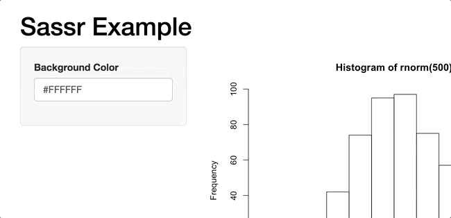

<!-- README.md is generated from README.Rmd. Please edit that file -->

```{r setup, include = FALSE}
knitr::opts_chunk$set(
  collapse = TRUE,
  comment = "#>",
  fig.path = "inst/figures/README-",
  out.width = "100%"
)
```


# [](https://sass-lang.com)


[](https://travis-ci.org/rstudio/sass) [](https://ci.appveyor.com/project/rstudio/sass)

The `sass` R package is a CSS preprocessor, letting R developers use variables, inheritance, and functions to generate dynamic style sheets.

`sass` uses the [Sass](https://sass-lang.com/) CSS extension language. Sass is stable, powerful, and CSS compatiable. `sass` is an R wrapper for [LibSass](https://github.com/sass/libsass), a fast Sass compiler written in C++.

## Installation

Install the released version of `sass` from CRAN:
```r
install.packages("sass")
```

Install the latest development build from Github:
```r
# install.packages("devtools")
devtools::install_github("rstudio/sass")
```

## Getting Started

The Sass language syntax is similar to CSS, but allows functions and variables, and can do arbitrary computations.

```{r}
library(sass)

sass("
  $size: 100%;
  foo { margin: $size * .33; }
")
```

For an overview of the major features of Sass such as variables, nesting, and imports check out the official [Sass Basics](https://sass-lang.com/guide).

## Examples

Checkout the `sass` Example [Shiny App](https://gallery.shinyapps.io/140-sass-size/) and the `sass` [website](https://rstudio.github.io/sass/articles/sass.html).

